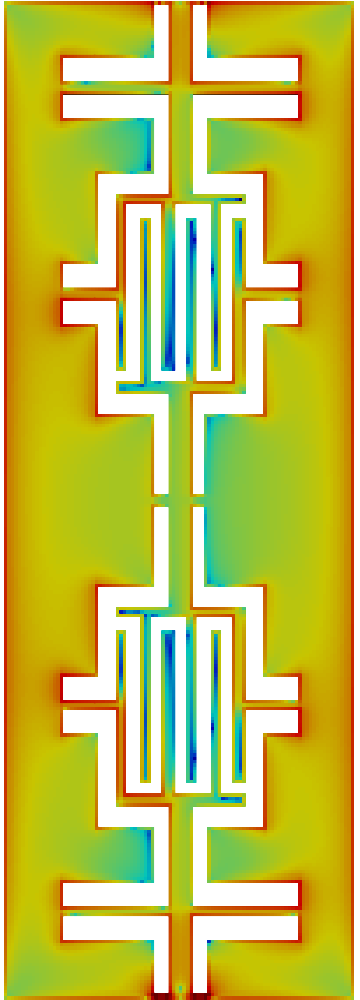

 
# FFT-PEEC 

This directory contains a FFT-PEEC code for electromagnetic problems

This code has been inspired by VoxHenry https://github.com/acyucel/VoxHenry

-------------------------------------------------------------------

# Description
 
FFT_PEEC_COND.m is the main file you must run to start the code. 

All user-settable quantities, e.g. frequency, are contained in the block identified by the 
BEGIN USER SETTINGS / END USER SETTINGS comments.

Available test cases
--------------------
Three simple test cases are contained in separate directories under "data". 
Set the "name_dir" variable in "FFT_PEEC_COND.m"  to the appropriate directory.

User-defined test cases
-----------------------
Follow the instuctions given in "README.txt" inside the "data" directory.

Results visualization
--------------------
In the "res_para" directory, the results generated by "FFT_PEEC_COND.m" are exported in 
Paraview format. 

Contacts & Authors
-----------------------
Riccardo Torchio (riccardo.torchio@unipd.it)

Francesco Lucchini (francesco.lucchini@studenti.unipd.it)
