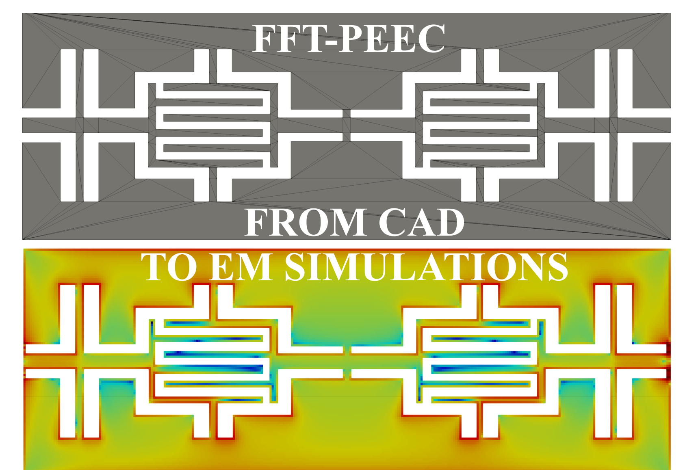

	

# FFT-PEEC 

This directory contains a FFT-PEEC code for electromagnetic problems

This code has been inspired by VoxHenry https://github.com/acyucel/VoxHenry

-------------------------------------------------------------------

# Description
 
FFT_PEEC_COND.m is the main file you must run to start the code. 

All user-settable quantities, e.g. frequency, are contained in the block identified by the 
BEGIN USER SETTINGS / END USER SETTINGS comments.

Available test cases
--------------------
Some simple test cases are contained in separate directories under "data". 
Set the "name_dir" variable in "FFT_PEEC_COND.m"  to the appropriate directory.

User-defined test cases
-----------------------
Follow the instuctions given in "README.txt" inside the "data" directory.

Results visualization
--------------------
In the "res_para" directory, the results generated by "FFT_PEEC_COND.m" are exported in 
Paraview format. 

Credits
--------------------
If you use FFT-PEEC, please consider citing:

 [1] [R. Torchio, "A Volume PEEC Formulation Based on the Cell Method for Electromagnetic Problems From Low to High Frequency," in IEEE Transactions on Antennas and Propagation, vol. 67, no. 12, pp. 7452-7465, Dec. 2019, doi: 10.1109/TAP.2019.2927789](https://ieeexplore.ieee.org/document/8764572)

 [2] [Bettini et al., "Fast Fourier transform-volume integral: a smart approach for the electromagnetic design of complex systems in large fusion devices", Plasma Physics and Controlled Fusion, Volume 63, Number 2, doi: 10.1088/1361-6587/abce8f](https://iopscience.iop.org/article/10.1088/1361-6587/abce8f)
 
 [3] R. Torchio et al., "FFT-PEEC: A Fast Tool From CAD to Power Electronics Simulations," in IEEE Transactions on Power Electronics, doi: 10.1109/TPEL.2021.3092431
 
and FFT-PEEC itself

 [4] R. Torchio, F. Lucchini, "FFT-PEEC toolbox", https://github.com/UniPD-DII-ETCOMP/FFT-PEEC

Contacts & Authors
-----------------------
For any questions or need help to solve your problem, please contact us

Riccardo Torchio (riccardo.torchio@unipd.it)

Francesco Lucchini (francesco.lucchini@studenti.unipd.it)
